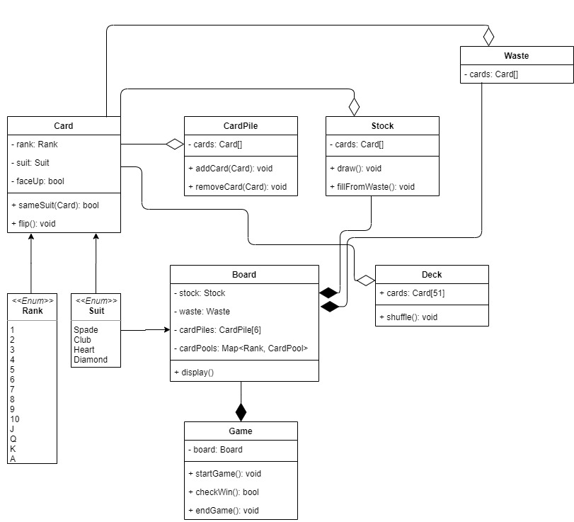

# solitareGame-JS STARTDOCUMENT

| Student name         | Student number |
| -------------------- | -------------- |
| Vladislav Atamanciuc | 4682025        |

## Description

This solitaire game is the final assignment for the course JavaScript in period 2.4.

## Introduction

The game is played with a standard pack of 52 cards. The cards come in 4 suits with two colors, spades (black), hearts (red), diamonds (red) and clubs (black). Within a suit, the ranks are, from low to high, ace, 2, 3,…,10,jack, queen and king.

 

The player starts the game by shuffling and dealing the pack of cards over several piles on the tableau, or playing table. After the player has dealt, there are 7 piles on the table containing 28 cards. The first pile has 1 card, the second 2, the third 3, and so on up to the seventh pile. Initially, the top card of each pile is turned face up; all other cards are face down. The remaining cards that are not part of the tableau are placed in the stock. Above the table there are four more suit-piles that are initially empty, one for each suit of cards. The suit-piles (sometimes called foundations) are built up from aces to kings in one suit. They are constructed as the cards become available. The object of the game is to build all 52 cards into the suit piles through a number of allowed moves.

## Class Diagram

The following diagram describes the classes and their methods:

## Setup

To set up the game the user needs a local server. This is preferably `Xampp`, but it should work with any other localhost. The user must place the files on the local server and open the `index.html` through the browser.

## Controls

The game has only one control:

`left-click` Select card and put it on different position

## References

https://www.google.com/url?sa=t&rct=j&q=&esrc=s&source=web&cd=&ved=2ahUKEwj3lZ797v7wAhUTBxAIHQF4B3AQFjAOegQIIBAD&url=http%3A%2F%2Fwww.win.tue.nl%2F2IM22%2FDownloads%2FDescription%2520of%2520the%2520game%2520of%2520Solitaire.doc&usg=AOvVaw2xK90mJajG4Tkk7A9N_iJG